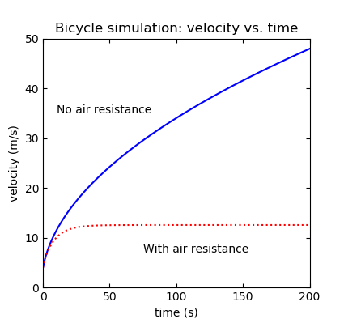
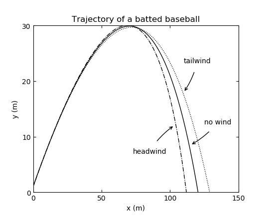
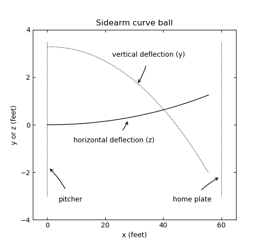

# comp-phys-python

A collection of simple, single purpose programs to simulate physical systems and generate visualizations using matplotlib. Each script reproduces plots from [*Computational Physics, 2nd Ed.*](https://www.amazon.com/Computational-Physics-2nd-Nicholas-Giordano/dp/0131469908)  by N. Giordano and H. Nakanishi. These were written as assignments in a collegiate computational physics course and may be freely used to aid in any application. Please do not copy this work in order to complete school assignments.

#### Dependencies:
Matplotlib must be installed to generate plots. Install it with 'pip install matplotlib'.

## List of program groups:

<<<<<<< HEAD
1. bicycle
  - bicycle.py: Calculates velocity vs. time with and without simplified air resistance, given a constant amount of work.

2. baseball
  - baseball-trajectory-wind.py: calculates the arc of a pop fly under different wind conditions. Simplified wind.
  - baseball-curveball.py: calculates drop and curve of a curveball.
  

>
3. simple-pendulum
  - simple-pendulum.py: simulates pendulum motion with zero drag and wind resistance.
  - driven-simple-pendulum.py: simulates three pendulums with drag and different driving forces.
=======
1. **bicycle**
   - bicycle.py: Calculates velocity vs. time with and without simplified air resistance, given a constant amount of work.

2. **baseball**
   - baseball-trajectory-wind.py: calculates the arc of a pop fly under different wind conditions. Simplified wind.
   - baseball-curveball.py: calculates drop and curve of a curveball.
  
3. **simple-pendulum**
   - simple-pendulum.py: simulates pendulum motion with zero drag and wind resistance.
   - driven-simple-pendulum.py: simulates three pendulums with drag and different driving forces.
>>>>>>> 31baf9496370d9fb195c529eef58f08279d548b9

4. **billiards** (bouncing ball off containing walls)
   - billiards-circular.py: simple bouncing off inner-walls of circle
   - billiards-stadium.py: same but with small flat section in the middle, altering the shape and bouncing behavior
  

*more soon*
